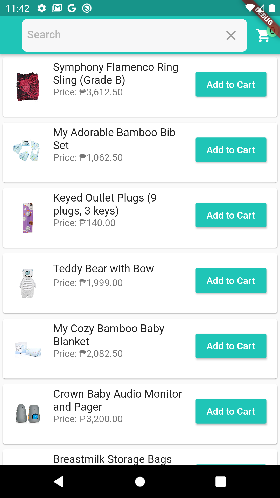
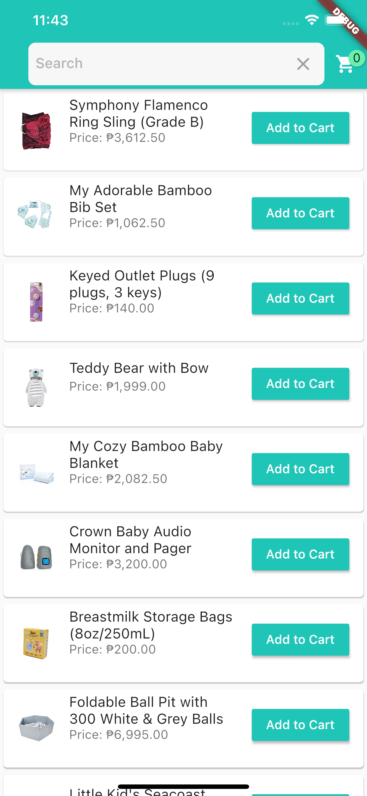

# Shopping cart using Firebase as backend and Algolia for full text search.

## How to run the project

For Windows follow this setup guide https://flutter.dev/docs/get-started/install/windows
* Need to open android emulator

for Mac follow this setup guide https://flutter.dev/docs/get-started/install/macos
* Need to open iOS simulator or android emulator

Open command line/terminal go to the root folder of the project and type the following:

flutter pub get

flutter run -d all

## Screenshots

        
       

        

